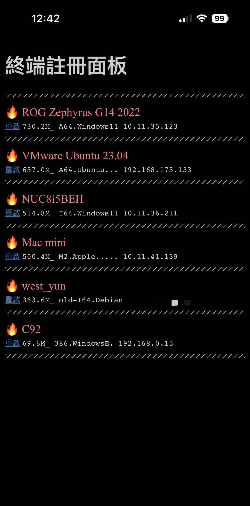

# PC-land / 終端註冊面板

The Terminal registration panel project.

 

### 计算平台类型

计算平台 | 表示含义 |
---: | --- |
`386` | 32 位 x86 处理器
`A64` | AMD 系列处理器
`I64` | Intel 系列处理器
`M2` | Apple M2 处理器
`arm64` | 其他 arm 处理器
`RISC-V` | RISC-V 处理器
`龙芯` | 龙芯处理器

 

## 功能

1. 终端设备展示列表
2. 终端计算能力打分
3. 终端 **计算平台类型** 展示
4. 终端局域网地址展示
5. 远程控制设备重启

 

## 预览

